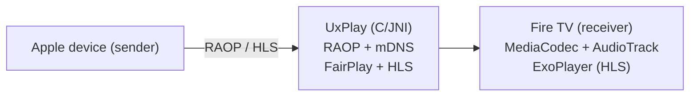

# DrChiodo Mirroring

[](LICENSE)
[](https://github.com/drchiodo/android-airplay-server/actions/workflows/apk.yml)

A Fire TV build of [jqssun/android-airplay-server](https://github.com/jqssun/android-airplay-server),
which wraps the [UxPlay](https://github.com/FDH2/UxPlay) AirPlay server for
Android. Pick the TV from the Screen Mirroring list on an iPhone, iPad or Mac
and its screen lands on the television. You install nothing on the sender.

Upstream targets phones and tablets, and ships on Google Play and F-Droid. Go
there for the original. This fork exists so the same receiver reads well from
a sofa, with a remote.

## What this fork changes

- A 10-foot layout for the idle screen and for settings, built to Amazon's
  published Fire TV rules: content inside the inner 90% of the screen, no text
  under 14sp, and focus that inverts the fill so you can find it from three
  metres away. Settings gains a left rail, so a D-pad reaches any of the five
  sections in two presses.
- A fixed dark palette on TV. A Fire TV reports night mode off, so the upstream
  theme hands a television its light scheme and the app comes out pale lavender.
- Its own name, icon and launcher banner.
- Raster launcher icons. Upstream ships the adaptive icon on its own, which
  Android 7.1 cannot read, so a Fire TV Stick 4K has no icon to draw.
- Amazon Appstore artwork under [`store-assets/`](store-assets), at the sizes
  Amazon asks for, safe areas included.

Everything else stays as upstream wrote it, phone layouts included.

## Tested on

| Device | Model | Fire OS | API | ABI | RAM |
|---|---|---|---|---|---|
| Fire TV Stick (3rd gen) | `AFTSSS` | 7.0 | 28 | `armeabi-v7a` | 922 MB |
| Fire TV Stick 4K | `AFTMM` | 6.0 | 25 | `armeabi-v7a` | 1.3 GB |

Mirroring a 1920x884 iPhone screen to the 3rd gen Stick, `dumpsys SurfaceFlinger
--latency` counts 126 frames over 2.32 seconds against a 60 Hz panel. That is
53.9 frames a second, with a median gap of 16.7 ms between them, which is one
vsync. The app holds 74 MB and uses 53% of one core out of four. The MediaTek
decoder carries the load.

Glass-to-glass latency measures 100 ms. A millisecond timer ran on the iPhone,
mirrored to the Stick, and one photograph caught both screens in the same
exposure: the phone read 29.560, the television 29.460. That is one sample, so
read it as an order of magnitude rather than a figure. Frame rate alone would
not have told you this. It says the decoder keeps up, and nothing about the
delay between the phone and the screen.

> [!WARNING]
> DRM content arrives black and silent. Netflix, Prime Video, Disney+ and
> anything else behind FairPlay will mirror as a black rectangle. The sender
> blocks the capture, so no receiver can do anything about it.

## Building

The CI builds on `ubuntu-latest`, and so should you. FFmpeg's `configure` is a
POSIX shell script, and CMake hands it to the OS as an executable. Windows
refuses it. Use WSL or a Linux box.

```bash
git submodule update --init --recursive
./gradlew assembleDebug
```

You need JDK 17 or later, the Android SDK, NDK 27.0.12077973 and CMake 3.22.1.
Gradle 8.11 rejects JDK 25, so pick 21 if you keep several.

To build for one ABI while you iterate:

```bash
./gradlew assembleDebug -Pandroid.injected.build.abi=armeabi-v7a
```

That writes the APK to `app/build/intermediates/apk/debug/` rather than
`outputs/`, and marks it `testOnly`, so install it with `adb install -t`. Drop
the flag for a build you mean to ship.

## Implementation

The C core of UxPlay handles RAOP, mDNS and FairPlay behind a JNI bridge under
[`app/src/main/cpp`](app/src/main/cpp). Kotlin owns the rest: MediaCodec
decodes H.264 and H.265 to a SurfaceView, AAC-ELD, AAC-LC and ALAC to an
AudioTrack, and ExoPlayer serves HLS sessions.



## Privacy

The app collects nothing and reaches no server of ours, because there is none:
no accounts, no analytics, no crash reporting, no third-party SDKs. What your
Apple device sends reaches the television over your own network and stops
there. The full statement, including what each permission is for and why an
AirPlay receiver is open to everyone on its network, sits at
[drchiodo.github.io/android-airplay-server](https://drchiodo.github.io/android-airplay-server/).

## Credits

- [jqssun/android-airplay-server](https://github.com/jqssun/android-airplay-server),
  the upstream this forks
- [UxPlay](https://github.com/FDH2/UxPlay) for the AirPlay and RAOP server
- [FFmpeg](https://ffmpeg.org) for the lossless audio decoder
- [Next Player](https://github.com/anilbeesetti/nextplayer) for the video player

GPLv3, like upstream.

---

Not affiliated with Apple Inc. or with Amazon.com, Inc. AirPlay is a trademark
of Apple Inc. Fire TV is a trademark of Amazon.com, Inc.
